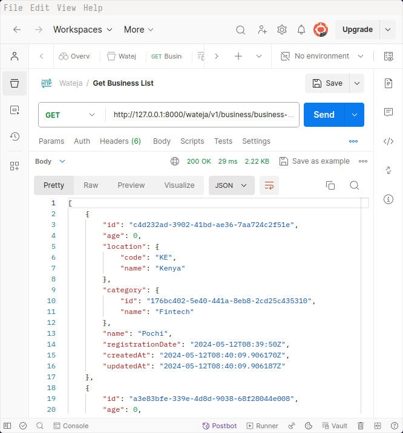
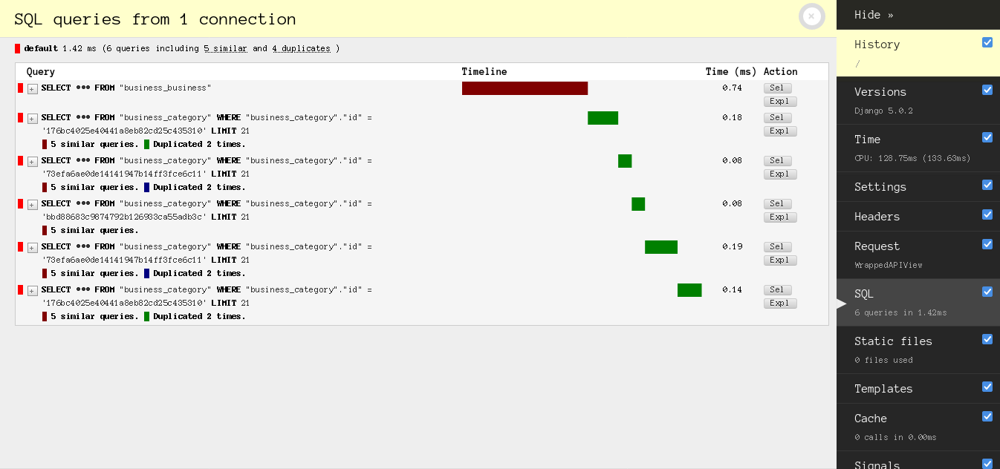

# :dollar: Wateja App
> :bulb: Coding Task
## 💬 Description
>  This is a backend API solution for managing customer information in a business setting.
## :ledger: Database Design
> The database consists of 3 tables (Category, Business, Customer) and 2 one-to-many relationships.
> 

## :books: Stack
> I used the following main technologies to create solution
> 1. Python Django - Create API
> 2. Redis - Caching
> 3. Docker - For shipping code
> 4. SQLite - Main Database
## :soccer: Task Goals
1. Create working API endpoints.
A few examples of the list of working endpoints and screenshots of the output in postman
	1. Get Business List
    
		
	1. Get Customer List
    
		
	 	
1. Implement resource utilization.
Implemented optimization techniques to make the solution more efficient.
 	1. Database ORM queries optimization
		> Without query optimization the API suffers from the n+1 problem which consists of additional queries to the database that can be avoided. Having unnecessary queries to the db makes the application less efficient and a huge problem when you scale up.
		> Here is a screenshot of the queries without optimization
		
  		
		
  		> By adding select_related on the queries introduces SQL joins which reduce the number of queries to the db.
		> Here is a screenshot of less queries after using select_prefetch
 
		
    
   	1. Caching views
   	   	> Caching also reduces queries to the db therefore improving performance.Frequently used endpoints results are cached in a redis database.
		> Here is a screenshot of the number of queries to the db without caching

		

		> By using caching queries are made to the redis db which is more faster and improves performance. The cache has a 15 minute timeout where the results needs to be cached again.
		> Here is a screenshot of less SQL queries after using redis caching
		
  		
	
## 🔧 Code Setup
   1. Clone the repo
        ```bash
            git clone https://github.com/devoure/wateja.git

        ```
## 💻🏃‍♂️ Running Code Snippet
   1. Run code
        ```bash
            cd docker
            docker-compose -f run.yaml up

        ```

